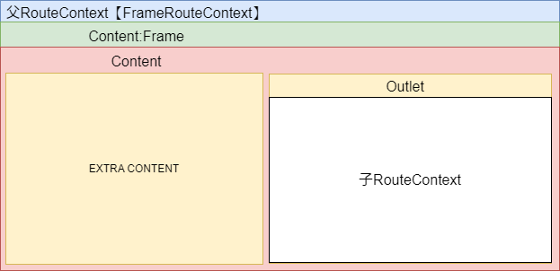

# 路由设计

## 路由器

* 提供统一的跳转入口
* 提供[`GoForwad`]/[`GoBack`]的历史记录功能
* 提供跳转相关的生命周期
* 提供统一的路由管理

## 通过route生成路由器

### RouteContext

* [`FrameRouteContext`]
  * 挂载在主[`Router`]上
  * 卸载的时候需要清理[`Frame`] 不然会多次触发加载
* [`WindowRouteContext`]
  * [`IsMultiple`]多窗体情况下 上下文不保存； 单窗体情况下 复用之前的上下文以及窗体
  * [`IsRouteRef`]存在对路由的关联关系 通知路由变化
* 加载窗体的时候 需要拷贝出一个[`IComponentHandler`] 当前使用[`WindowRefHandler`] 构建依附在窗体的顶级[`FrameRouteContext`]

### OUTLET

* 包含子[`RouteContext`]

### Matcher

* 暂时统一管理
* 提供所有静态可达的路由
* 提供对路由（暂时仅包括key、path，后续可以增加一些描述或者名称相关的路由信息）的全文分词索引

### 支持windows路由

* 把当前[`RouteContext`]拷贝一个[`WindowRouteContext`]出来 并且把该上下文 放到Window中
  * 好处是： 路由可以获取到自己的路由上下文 与非windows路由逻辑一致
* 原先的上下文单纯处理加载逻辑（包括创建Window以及Show）
* [`WindowRouteContext`]的加载逻辑 不重新走生成组件的逻辑，而是重新附加新的加载逻辑（直接处理Frame跳转）
* 根据路由配置 ，决定是否需要在主路由的视觉树上体现
  * 如果支持多窗体 则在窗体展示之前 把视觉树上的路由去掉
  * 如果不支持 则保留该视觉树 这就意味着 跳转的时候路由不变化

### 历史记录

* 暂时不支持清理

## 组件嵌套关系

