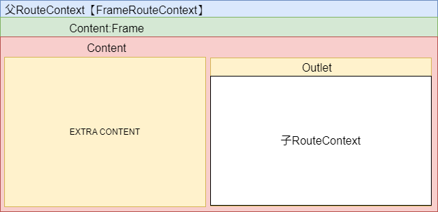

# Router.WPF

WPF 单页应用的小型路由库 —— 嵌套路由、类型化路径参数、`Outlet` 渲染、独立窗体、可搜索路由表，零 NuGet 依赖。

```csharp
Router.Wpf.Router.InitRouter("/home",
    new Route("home",    "home",    new FuncComponentHandler(_ => new HomeView())),
    new Route("profile", "profile", new FuncComponentHandler(_ => new ProfileView())),
    new Route("user",    "user/{id:int}",
        new FuncComponentHandler(p => new UserView { DataContext = new UserVm(p.Parameters) })));
```

```xml
<Window xmlns:r="clr-namespace:Router.Wpf;assembly=Router.WPF">
    <DockPanel>
        <ContentControl x:Name="RouterHost"/>
    </DockPanel>
</Window>
```

```csharp
public MainWindow() {
    InitializeComponent();
    RouterHost.Content = this.CurrentRouter();   // 全局 router 实例
}
```

## 特性

- 路由嵌套 —— 父路由通过 `<r:Outlet/>` 渲染当前匹配的子路由
- 类型化参数 —— `{id:int}` / `{name:string}` / `{theme?}` 自动转换 + 可空段
- 三类 Handler —— inline 视图 / 独立 Window / TaskHandler（占位）
- 浏览器风格历史 —— `Navigate` / `GoBack` / `GoForwad` / `Refresh`，`PushRecord` 截断前进栈
- LCA-diff 跳转 —— 同 Route 不同参数原地复用 context；不同 Route 才 Dispose+重建
- 路由全文搜索 —— 带前缀匹配、字段加权、`topN`
- `NavigateAsync(target, ct)` —— 当前是同步的薄包装，预留 `CanActivate` / 异步加载入口
- 零外部依赖 —— 仅依赖 BCL（曾经依赖 Lucene.Net / Pidgin / System.Reactive，全部已替换为内置实现）

## 概念

### `Router`

应用级路由实例，由 `Router.InitRouter(...)` 创建一次并放入 `Application.Current.Properties`。`element.CurrentRouter()` 返回最近一个视觉父级 `Router`，回退到全局实例（支持多 Router scope 的扩展点）。

### `Route`

```csharp
new Route(
    key:     "billing",                              // 唯一标识
    path:    "billing-and-plans",                    // 相对于父路由的 path 片段
    handler: new FuncComponentHandler(p => new BillingView()))
{
    Children = new List<Route> { /* ... */ }         // 可选嵌套
}
```

`IndexRoute(key, handler)` 是没有 path 段的子路由，作为父路由的默认子。

### `IRouteContext`

每个匹配到的 Route 在运行时对应一个 `IRouteContext`（`FrameRouteContext` 或 `WindowRouteContext`）。Router 维护当前活跃链 `_activeChain: List<IRouteContext>`，跳转时通过 LCA diff 增量替换尾部，`Dispose` 旧节点。

### `Outlet`

```xml
<r:Outlet/>
```

放在父 view 里，标记"子路由内容渲染到这"。Outlet 在 `Loaded` 时通过 `FindVisualParentUntil<IParentRouteContext, Router>` 找到外层 context，订阅其 `OnOutletChanged`，把 `OutletRouteContext` 设为自己的 `Content`。

## 路径语法

| 段 | 含义 | 例 |
|---|---|---|
| 静态 | 字面匹配 | `/profile` |
| `{name:int}` | 必选整数参数 | `/users/{id:int}` |
| `{name:string}` | 必选字符串参数 | `/blocked/{userId:string}` |
| `{name:float}` / `:double` / `:long` / `:short` / `:byte` / `:char` | 其它内置数值类型 | |
| `{name?}` | 可选段（缺失 / 空串） | `/preferences/{theme?}` |
| 混合段 | 静态 + 动态拼接 | `/{prefix}-{id:int}` |

参数值通过 `RouteMatch.Parameters` 字典访问，类型化值会以正确的 .NET 类型放入字典：

```csharp
new FuncComponentHandler(p => {
    int userId = (int)p.Parameters["id"];
    return new UserView { DataContext = new UserVm(userId) };
})
```

非法 pattern（缺前导 `/`、未闭合 `{`、未知类型 tag、重名参数）抛 `ArgumentException` / `InvalidOperationException`，消息中带 pattern 字符串。

## Handler 类型

| Handler | 渲染目标 | 典型用途 |
|---|---|---|
| `FuncComponentHandler(Func<RouteMatch, FrameworkElement>)` | 主路由 frame 或父路由 `Outlet` | 大部分页面 |
| `WindowHandler(Func<RouteMatch, WindowResult>, multiple, refRoute)` | 独立 `Window` | 弹窗、设置面板、详情窗 |
| `ActionHandler(Action<RouteMatch>)` (`TaskHandler`) | 不渲染，仅副作用 | 占位，当前未在主分发路径完整支持 |

### `WindowHandler` 真值表

`WindowHandler` 有两个布尔参数 —— `IsMultiple` 决定是否每次跳转都新开窗体；`IsRouteRef` 决定路由离开时是否关闭窗体。组合语义：

| `IsMultiple` | `IsRouteRef` | 行为 | 典型用例 |
|---|---|---|---|
| `false` | `true` | **单窗体 + 跟随路由**：同一窗体复用，内容随路由切换；导航到其他路由时关闭。 | 设置 / 偏好面板 |
| `false` | `false` | **单窗体 + 独立寿命**：内容随路由切换，但路由离开后窗体仍开着。 | 浮动调试窗 |
| `true`  | `true` | **多窗体 + 跟随路由**：每次导航开新窗体，旧窗体在跳转时通过 `Dispose` 链关闭。 | 多实例编辑器 |
| `true`  | `false` | **多窗体 + 独立寿命**：每次导航开新窗体，旧窗体保留供用户手动关闭。 | 弹出式详情、多 tab 副窗 |

注：`IsMultiple=true` 是 LCA diff 的"强制替换锚点" —— 即使路径完全相同，每次跳转都把这一层及其子链 `Dispose+重建`，所以总是新开窗体。

## 导航 API

```csharp
var router = element.CurrentRouter();

router.Navigate("/users/42", extraData: new { from = "list" });   // 同步，返回 bool
await router.NavigateAsync("/users/42");                            // 异步壳子
router.GoBack();                                                    // 退栈，索引仅在 Navigate 成功时回退
router.GoForwad();                                                  // 进栈
router.Refresh();                                                   // 不入历史，清 _activeChain 重建
router.CanGoBack / router.CanGoForward;
router.CurrentTarget;
router.PathRecord;                                                  // 全部历史
router.BackStack;                                                   // 当前位置之前
router.ForwardStack;                                                // 当前位置之后

router.NavigationRequested.Subscribe(args => { /* 跳转事件 */ });    // Notifier<T>
```

`Navigate` 返回 `false` 时不入历史、不发 `NavigationRequested`、不改 `CurrentTarget`。`GoBack` / `GoForwad` 仅在 Navigate 成功时移动 `_pathIndex`，避免历史指针被无效路径腐化。

## 路由搜索

`router.RouteCollection.Search(query)` 返回 `IEnumerable<RouteSearchInfo>`，按 `route.Key`（权重 2.0）和 `path`（权重 1.0）做前缀匹配 + 加权打分。

```csharp
foreach (var hit in router.RouteCollection.Search("plan", topN: 5))
    Console.WriteLine($"{hit.Key}  ->  {hit.Path}");
//  plan-and-usage  ->  /billing-and-plans/plans-and-usage/{userId:int}
//  plan            ->  /billing-and-plans/plans-and-usage/{userId:int}/plan/{planId:int}
```

切词规则：小写 + 按非字母数字字符分段。所以 `bill` 命中 `billing-and-plans` 里的 `billing` token；`/` 和 `-` 都是分隔符。

## Sample

`Router.WPF.Sample` 是一个完整的 demo，覆盖：

- 嵌套路由 + `IndexRoute`（`/moderation/blocked-users` → 默认子；`/moderation/blocked-users/alice` → 命名子）
- 类型化参数（`/billing-and-plans/plans-and-usage/{userId:int}/plan/{planId:int}`）
- 可空段（`/preferences/{theme?}`）
- `WindowHandler` 多窗体（`/billing-and-plans/plans-and-usage/...`，`IsMultiple=true`）
- `WindowHandler` 单窗体（`/settings/general` | `/security` | `/notifications`，`IsMultiple=false, IsRouteRef=true`）
- 顶部地址栏直接跳转、Back/Forward/Refresh、历史显示、`extraData`
- 路由搜索（前缀匹配，敲两个字符就有结果）
- `GetRouteMatches()` 反查当前元素所在的整条匹配链

```bash
dotnet run --project Router.WPF.Sample
```

## 测试

`Router.WPF.Tests`（xUnit + `Xunit.StaFact`），74 用例：

- `PathUtilTests` —— `Combine` / `Normalize` 边界
- `TypePathParserTests` —— 静态 / 类型化 / 可空 / 多动态段 / 重名抛异常 / 未知 tag
- `HashEqualsTests` —— `PathMatch.Equals` 不依赖字典枚举顺序
- `IndexRouteCollectionTests` —— 嵌套链匹配、IndexRoute、leaf 替代 IndexRoute、no match
- `LuceneIndexerTests` —— 前缀匹配、`topN`、特殊字符、增量索引（替换 Lucene 之后名字保留）
- `RouterHistoryTests` —— `BackStack` / `ForwardStack` 语义、`PushRecord` 截断、Navigate 失败时索引不腐化、`NavigateAsync` cancellation
- `LcaDiffTests` —— 初次挂载、参数变化复用、Route 不同 Replace、链截断、同路径无 mutation、`IsMultiple=true` 强制替换、`Refresh` 重建
- `WindowHandlerTests` —— `IsMultiple=false` 复用 Window、Title 跟参数变化、`IsMultiple=true` 每次新开、`IsRouteRef` 控制 Dispose 时是否关窗、手动关窗清 `CurrentWindow`
- `RouteContextDisposeTests` —— `Dispose` 完成 Subjects、幂等、清引用

```bash
dotnet test
```

## 组件嵌套



## 依赖

零 NuGet。`Router.WPF.csproj` 仅依赖 BCL + WPF。

测试工程额外用了 `xunit` / `xunit.runner.visualstudio` / `Xunit.StaFact` / `Microsoft.NET.Test.Sdk`，仅测试时拉取。
